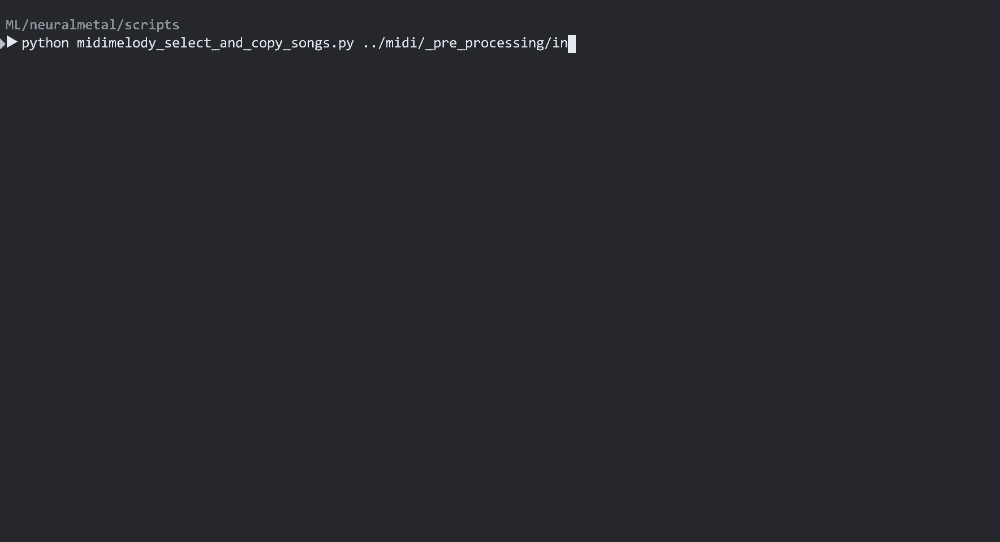

# Neural Metal - Midifile 2 abc
[](http://opensource.org/licenses/MIT)
[](https://twitter.com/g_massol)

Scrape, Download, Categorize and convert midi files into abc files. The midifiles are separated by instrument which can then be used to train LSTM/RNN models. 



***:warning: Work in progress: This is an experimental project that need to be updated so use at your own risk:warning:***

The scraping is done on 2 websites: [midimelody.ru](http://en.midimelody.ru/) (metal music mostly) and [ninsheetmusic.org](http://www.ninsheetmusic.org/) (Nintendo Sheet Music)


## Usage

### 0. Scrape midi files urls
I've used [Chrome Web Scraper](http://webscraper.io/) you can find the sitemaps in the folder ```web scraper``` the scraper return a csv file with all the urls

### 1. Download files
Parse the csv file and save all midi files locally. 
```python download_mid_from_csv.py path/to/csv/file path/to/midi/folder```

### 2. Tag 
Tags all files using [Musicbrainz](https://musicbrainz.org/) API and save all info in a local DB

### 3. Select files by tag
Select files by tags (musical style)

### 4. Parse and convert
Parse selected midi files, convert them to abc (one file per instrument)

### 5. Train + Generate
Follow [instruction for Torch-RNN](https://github.com/jcjohnson/torch-rnn#usage) for training then generate songs tracks using ```generate_mid.py```

## Models + Datasets

Add link to models & datasets here.

## Requirements:

[Chrome Web Scraper](http://webscraper.io/) for scraping but you could use some other scraper, [python-musicbrainzngs](https://github.com/alastair/python-musicbrainzngs) for tagging, [xattr](https://github.com/xattr/xattr) for extended filesystem attributes (not properly implemented yet) [midiABC](http://abc.sourceforge.net/abcMIDI/original/) for midi<->abc convertion, [Torch-rnn](https://github.com/jcjohnson/torch-rnn) to train / generate midi files.


## Possible improvements
- [ ] _Musicbrainz:_ Improve the 'accuracy' of the tagging (multiple search results for one artist name, maybe sort the ```Score```)
- [ ] _Musicbrainz:_ Get additional info (?)
- [ ] Create a main.py file to centralize all steps
- [ ] Add more parameters as args (folder path)
- [ ] Improve the creation / and update of the SQLLite DB:
    - [ ] Create/update the DB when downloading the files (?)
    - [ ] (Better) indexing 
    - [ ] Update instead of overwriting
- [ ] Try different RNN/LSTM models architecture
- [ ] Separate the music generation part (?)